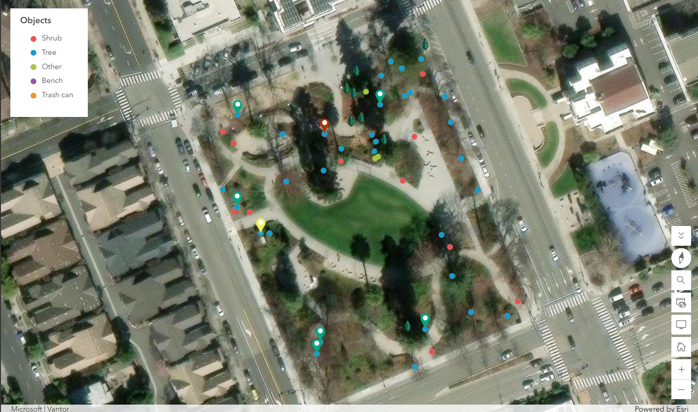
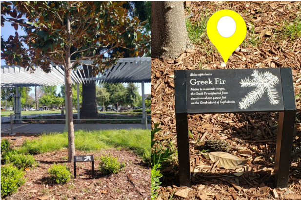
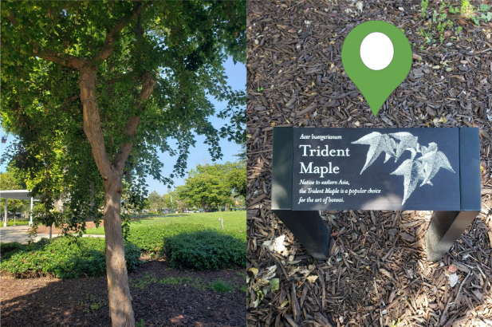

<div style="max-width: 750px; margin: 0 auto; padding: 0 40px;" markdown="1">

# Field Mapping At Local Park
### Signage and Redwood Tree Tracking

```
Written and Mapped by Sylvia Nwakanma
```

Using ArcGIS's FieldsMap App, I created a field map of Hayward park, just opposite the library located downtown. I saw this assignment as a great opportunity to expand my interests in plant identification. I also enjoyed getting into the weeds of data categorization. UPDATE

<p align="center">
  
  <small><i>Digital map of Hayward park living assets</i></small>
</p>

## A Path Forward

When creating a field map in ArcGIS, there is an option to add a point, line, or polygon layer to the map. Any data that naturally falls into either of these categories can be stored in the respective layer. For instance, a walking path at the park is data that can be stored as a Line layer. Using the streaming feature in the FieldMaps App on my phone, I was able to trace out the walking paths at the Hayward park. As you can see from the map, the paths are not perfectly smooth, but they give a good sense of how the park is divided. Although I can easily see the walking paths when I change the base layer of my map to Terrain, being able to stream my path is still incredibly useful. I can categorize the type of path based on the surface material (for example: gravel, paved, dirt) that may not be clear from aerial photography. This type of categorization can be useful when making decisions about mobile accessibility. Moreover, as a roller skater, I care a lot about surfaces. If I were looking for a new park to skate around, I would be interested in the types of surfaces my wheels might encounter. 


## Points of Interest

  I enjoy identifying the plant life around me, so I saw this assignment as the perfect opportunity to take inventory of what’s growing at the Hayward park. At first, I did not know how I wanted to categorize these plants. I knew plants would all fall under a Points layer since I planned to document each species individually. But should I classify everything under a single “Plant” category? I was interested in documenting the Redwood trees too. I love their shape and I am impressed by their towering heights. I also find it interesting that they are  legally protected in the city of Hayward . Should I create a second object layer just for Redwood trees? Or should Redwood trees be its own subcategory? I wanted the map to be versatile for different types of analysis, but specific enough to my immediate interests. 

  I found a happy medium by creating a Tree and Shrub subcategory under a general Object category. I ended up documenting the type of tree or shrub in the notes field of each data entry. (There are various types of grasses and groundcovers growing at the park. We will pretend those do not exist for now). 


## A Good Sign

While collecting plant data in Hayward park, I noticed that some of the trees had signage (only the trees, not the shrubs). Though I have visited this park hundreds of times over the years, this was the first time I saw signage. At first, I used this information in my notes field to identify plant names that I was unsure of or unfamiliar with. I was delighted by this unexpected aid. Until, at least, I discovered that something was off. One of the signs was for a tree that did not exist. Inscribed was Abies cephalonica commonly known as Greek Fir. Perhaps it did in the past, but the tree now standing behind the signage was clearly not a Greek Fir tree. 

<p align="center">
  
  <small><i>Left: Southern Mangolia tree. Right: incorrect botanical signage for Greek Fir</i></small>
</p>


It was a Southern Magnolia tree. I knew this because there is one growing right outside my bedroom. I realized that the signage was not just a personal memory aid, but a valuable feature of my map. I decided then to document all botanical signage. I opted out of creating another subcategory under in the Points layer just for signage. Since signage is spatially located right next to their respective plants, this could look visually clunky on a map. The Sketch layer was again an ideal tool to document this new information. I dropped pins on trees that had signage. Green pins for correct signage; yellow pins for incorrect signage. From the standpoint of a Parks and Recreational department, this is valuable information that can be used for planning when displayed in this format. 

<p align="center">
  
  <small><i>Left: Trident Maple tree. Right: correct botanical signage for Trident Maple</i></small>
</p>

This was a fun assignment with a number of unexpected turns. I got to learn new plant names and think through the intricacies of data collection. I also got more familiar with ArcGIS’s FieldMaps, a powerful tool with more applications than I can imagine. I am glad I deviated off script a bit.

```
This project was develeped while completing a certificate program in Geographical Information System (GIS) at Chabot College
```

</div>

