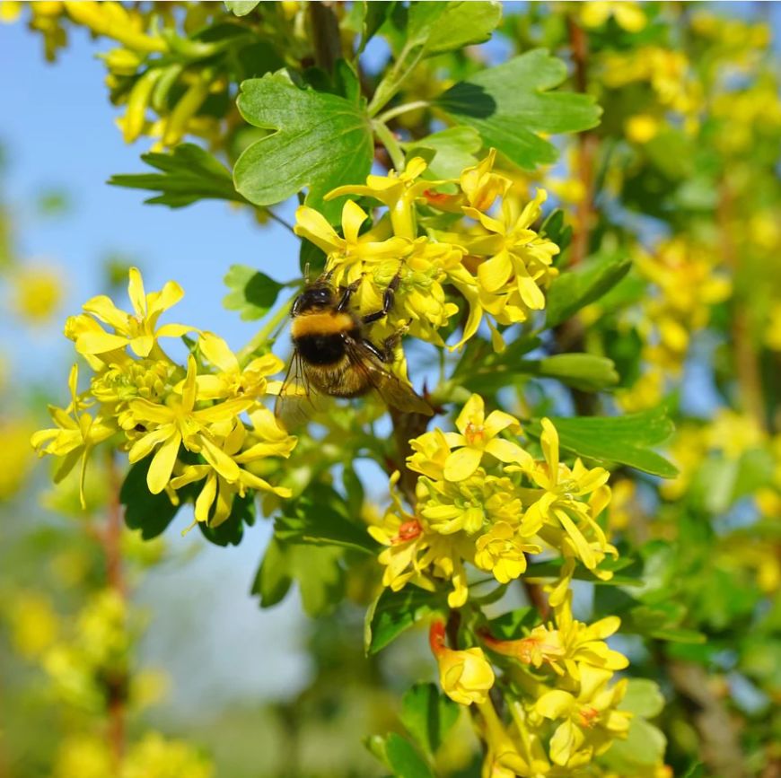
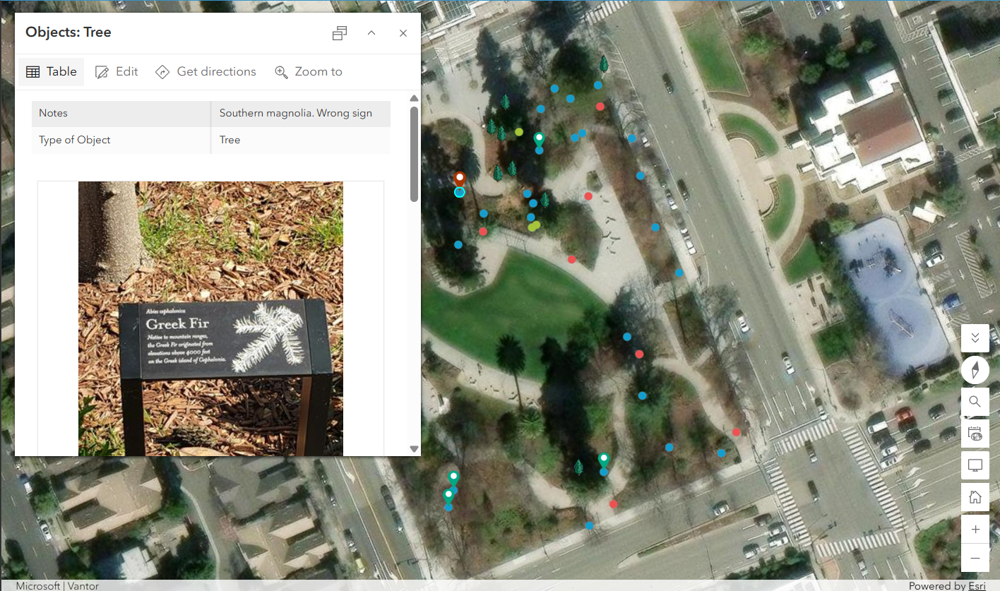
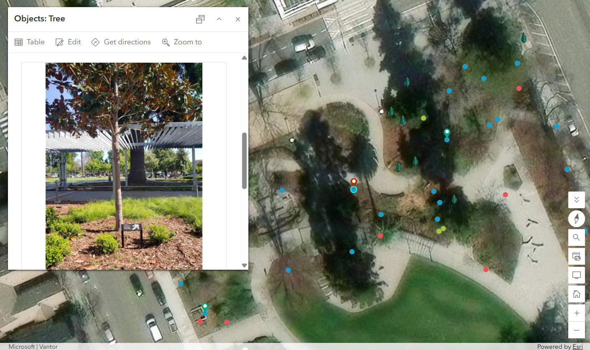
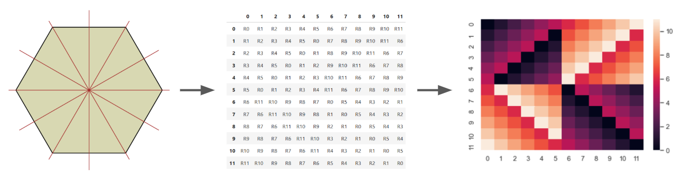

# Project Portfolio


A nursery professional, statistician, and digital mapper seeking to combine the best of all worlds. 

Below are some of my projects highlighing skillsets that include digital map-making, data integration, data analysis, coding, and quantitative reasoning

## Digital Mapping

One of the benefits of a digital map is the ability to transform space into a database for intuitive information retrieval. Especially in the field of horticulture, knowing where plants are rooted or temporarily placed opens the door to questions about access, plant interaction, symbiosis. An a list of plants and their attributes just won't do. The projects below were started while earning an Associates degree in Geographical Information Systems (GIS) at Chabot College. 

```
Map of Nursery
```
One of the most frequently asked questions at my nursery is "where is x plant?" I created a digital map of the nursery so that customers and staff can address questions like these.



```
Park Tree Inventory 
```





## Coding 
```
Visualizing Geometric Symmetries
```
While completing a Master degree in Statistics at San Francisco State Universtiy, I took an Abstract Algebra course. I learned that, like the integers or real numbers, shapes have multiplication tables too. These multiplication tables can look even more abstract than a 12x12 times table, with letters and numbers corresponding to a rotation or reflection of an underlying shape. I wondered what a square's multiplication talbe looked like with color. I computed the multiplication tables of squares, hexagons, and rectangles in Python, then applied heat maps to these tables to reveal their symmetries.


    
<div style="max-height: 150px; max-width: 100%; overflow: auto;">
<pre><code class="language-python">

Helper functions

"""
This function is used to create a permutation of the vertices of an n-sided polygon induced by rotations and reflections. 
Inputs:
    n (int) is the number of polygon vertices
    start (int) is the starting value of the dictionary
    ref (bool) is True if the permutation is induced by a reflection. False otherwise
    
Output: 
    R is the dictionary representing a permutation of n vertices begining with start
"""
def Rn(n,start,ref):
    R = {}
    key = 1
    val = start
    for i in range(n):
        R[key] = val     
        key += 1     
        if ref:   
            val -= 1
        else: 
            val += 1
        val = val%n
        if val == 0:  # n mod n is 0, val = 0. But we want val = n
            val = n
    return R
</code></pre>

</div>

The full code script can be found <a href="https://github.com/Akunwa/portfolio2/blob/main/assets/doc/vis_geom_sym.ipynb" target="_blank" rel="noreferrer noopener">here</a>

```
Naïve Bayes Classifier From Scratch in Python
```
Naïve Bayes Classifier can be used to predict the value of a response variable given a set of input data. This classifier bases its predictions using bayes rule, an equation which computes the probability of an outcome given the occurrence of a set of events. I studied bayes rule in depth to write an algorithm that implemented the Naïve Bayes Classifier on a dataset with a binary response variable. Although Python has libraries that can implement this classifier with a few lines of code, I wrote the <a href="https://github.com/Akunwa/Akunwa.github.io/blob/main/documents/csc869MiniProject1.ipynb" target="_blank" rel="noreferrer noopener">algorithm</a> from scratch to get a deeper understanding of this prediction algorithm and coding. 

## Quantitative Analysis 

```
Large survey data analysis
```


## Writing
```
Technical writing for a general audience
```
The <a href="https://github.com/Akunwa/portfolio2/blob/main/assets/doc/SeniorThesisChpt1.pdf" target="_blank" rel="noreferrer noopener">introductory chapter</a> of my year-long undergraduate senior thesis at Pomona College on mining summary information from large text data
```
Technical writing for a technical audience
```
The <a href="https://github.com/Akunwa/portfolio2/blob/main/assets/doc/MSRI_technical_report.pdf" target="_blank" rel="noreferrer noopener">results section</a> of a research paper written during a summer undergraduate fellowship at the Simons Laufer Mathematical Institute in Berkeley, CA 


