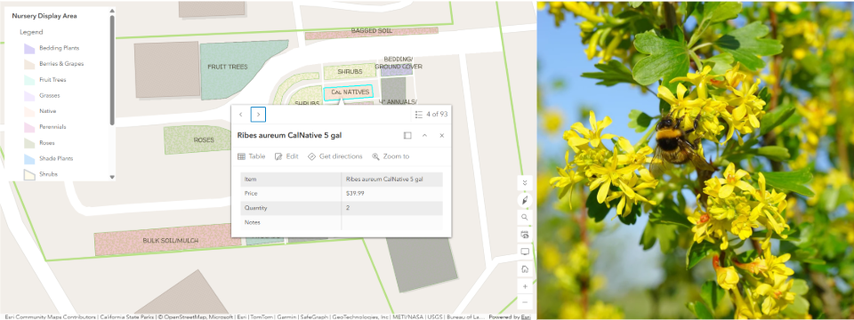
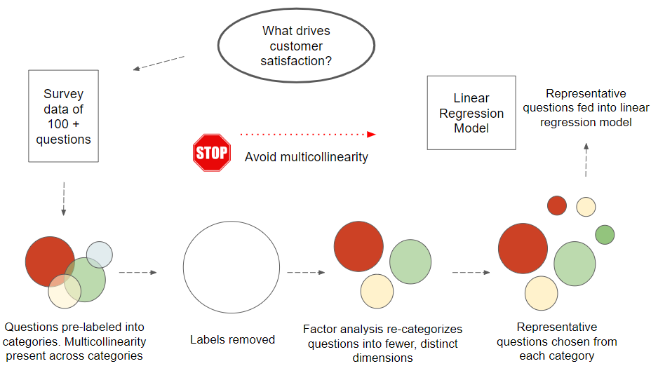

# Project Portfolio


Nursery professional, statistician, and digital mapper seeking to combine the best of all worlds. 

Below are some of my projects highlighing skillsets that include digital map-making, data integration, data analysis, coding, and quantitative reasoning

## Digital Mapping

One of the benefits of a digital map is the ability to transform space into a database for intuitive information retrieval. Especially in the field of horticulture, knowing where plants are rooted or temporarily placed opens the door to questions about access, plant interaction, symbiosis. A a list of plants and their attributes just won't do. The projects below were developed while earning an Associates degree in Geographical Information Systems (GIS) at Chabot College. 

```
Map of Nursery
```
One of the most frequently asked questions at my nursery is "where is x plant?" I created a digital map of the nursery so that customers and staff can address questions like these.

<p align="center">
  
  <small><i>Digital map of nursery</i></small>
</p>

<p align="center">
  
  <small><i>Left: native California plant in inventory. Right: Ribes aureum Golden Currant</i></small>
</p>


```
Park Tree Inventory 
```
I mapped the trees and shrubs at my local park using the ArcGIS's Fields Map App, a mobile application which enables real-time spatial data collection. I also assesed the accuracy of botanical signage around the park, flagging incorrect signage on the map.

<p align="center">
  
  <small><i>Digital map of Hayward park with living assets</i></small>
</p>

You can read more about this project <a href="fieldMap.html" target="_blank" rel="noreferrer noopener">here</a>.


## Coding 
Below are some of my favorite Python scripts I have written so far, one for a course while completing my Masters degree at San Francisco State University. This first script was written out of stubborn curiosity.  
```
Visualizing Geometric Symmetries
```
I took an Abstract Algebra course where I learned that, like the integers or real numbers, shapes have multiplication tables too. The entries in these multiplication tables correspond to the rotations and reflections of the shape. Some rotations and reflections of a shape do not alter its look. These permutations are the shape's symmetries. I wondered what these multiplication tables looked like rendered in color. I especially wanted to know how these symmetries appeared. I computed the multiplication tables of a square, hexagon, and rectangle in Python using dictionaries to store their rotations and reflections. I then applied heatmaps to these tables as shown below. The hexagon has 12 symmetries. Can you spot them in the heatmap?  

<p align="center">
    
    <small><i>From left: 12 symmetries of a regular hexagon. Multiplication table of a regular hexagon. Heatmap of multiplication table</i></small>
</p>
    
<div style="max-height: 150px; max-width: 100%; overflow: auto;">
<pre><code class="language-python">
Helper functions
"""
This function is used to create a permutation of the vertices of an n-sided polygon induced by rotations and reflections. 
Inputs:
    n (int) is the number of polygon vertices
    start (int) is the starting value of the dictionary
    ref (bool) is True if the permutation is induced by a reflection. False otherwise
    
Output: 
    R is the dictionary representing a permutation of n vertices begining with start
"""
def Rn(n,start,ref):
    R = {}
    key = 1
    val = start
    for i in range(n):
        R[key] = val     
        key += 1     
        if ref:   
            val -= 1
        else: 
            val += 1
        val = val%n
        if val == 0:  # n mod n is 0, val = 0. But we want val = n
            val = n
    return R
</code></pre>

</div>

<br>
<<<<<<< HEAD
The full Python script can be found <a href="https://github.com/Akunwa/portfolio/blob/main/assets/doc/vis_geom_sym.ipynb" target="_blank" rel="noreferrer noopener">here</a>

```
Naïve Bayes Classifier From Scratch in Python
```
<<<<<<< HEAD
Naïve Bayes Classifier can be used to predict the value of a response variable given a set of input data. This classifier bases its predictions using bayes rule, an equation which computes the probability of an outcome given the occurrence of a set of events. I studied bayes rule in depth to write an algorithm that implemented the Naïve Bayes Classifier on a dataset with a binary response variable. Although Python has libraries that can implement this classifier with a few lines of code, I wrote the <a href="[assets/doc/csc869MiniProject1.ipynb](https://github.com/Akunwa/portfolio/blob/main/assets/doc/csc869MiniProject1.ipynb)" target="_blank" rel="noreferrer noopener">algorithm</a> from scratch to get a deeper understanding of this prediction algorithm. 

## Quantitative Analysis 

```
Survey Analysis On Customer Satisfaction
```
This project was part of my 3 month internship with Kaiser Permanente, one of the largest healthcare and insurance providers in the United States. The dataset used comprised of quanitative and qualitative responses to over 100 questions with over 5000 survey respondants. I used factor analysis to reduce the dimension of the data set, extracting 10 key performance indicators from a survey of over 100 questions. The responses to these questions were used to gauge what influences Kaiser Permanente member satisfaction

<p align="center">
  
  <small><i>Flowchart of survey analysis</i></small>
</p>

## Writing

Technical writting for a general audience. The <a href="assets/doc/SeniorThesisChpt1.pdf" target="_blank" rel="noreferrer noopener">introductory chapter</a> of my year-long undergraduate senior thesis at Pomona College on mining summary information from large text data. UPDATE1

Technical writting for a technical audience. The <a href="assets/doc/MSRI_technical_report.pdf" target="_blank" rel="noreferrer noopener">results section</a> of a research paper written during a summer undergraduate fellowship at the Simons Laufer Mathematical Institute in Berkeley, CA 


