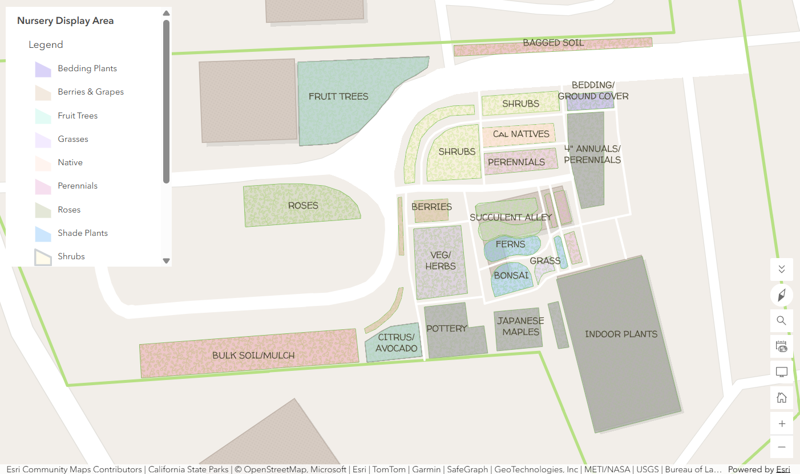
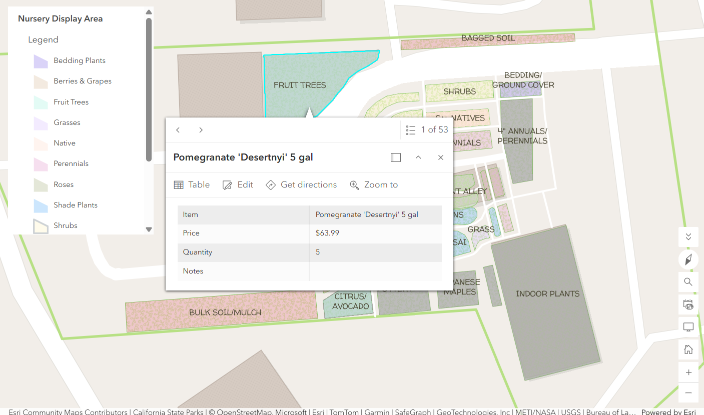
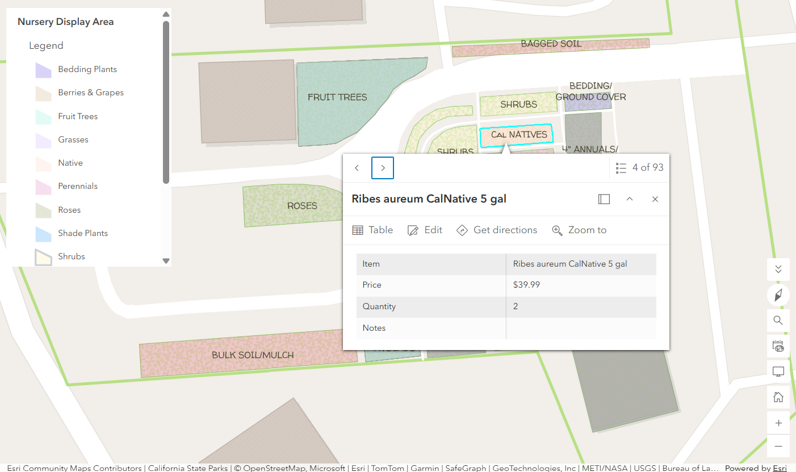

```
# Project Portfolio
```

A nursery professional, statistician, and digital mapper seeking to combine the best of all worlds. 

Below are some of my projects highlighing skillsets that include digital map-making, data integration, data analysis, coding, and quantitative reasoning

# Digital Map-Making

One of the benefits of a digital map is the ability to transform space into a database for intuitive information retrieval. Especially in the field of horticulture, knowing where plants are rooted or temporarily placed opens the door to questions about access, plant interaction, symbiosis. An a list of plants and their attributes just won't do. The projects below were started while earning an Associates degree in Geographical Information Systems (GIS) at Chabot College. 

## Map of Nursery

One of the most frequently asked questions at my nursery is "where is x plant?" I created a digital map of the nursery so that customers and staff can address questions that begin with Where.






## Park Tree Inventory 


```
The final element.
```
